# Autonomous Truck Inspection System
## Technical Architecture & System Design

**Document Version:** 1.0  
**Date:** December 2025  
**Purpose:** Executive Technical Presentation

---

## Executive Summary

This document presents the technical architecture of an autonomous truck inspection system built on ROS 2 Humble. The system enables a mobile robot to autonomously navigate to parked trucks, detect them using AI vision models, and systematically inspect all four wheels of each truck. The solution integrates computer vision, 3D perception, and autonomous navigation to deliver a complete inspection workflow.

---

## 1. System Architecture Overview

### 1.1 High-Level System Block Diagram

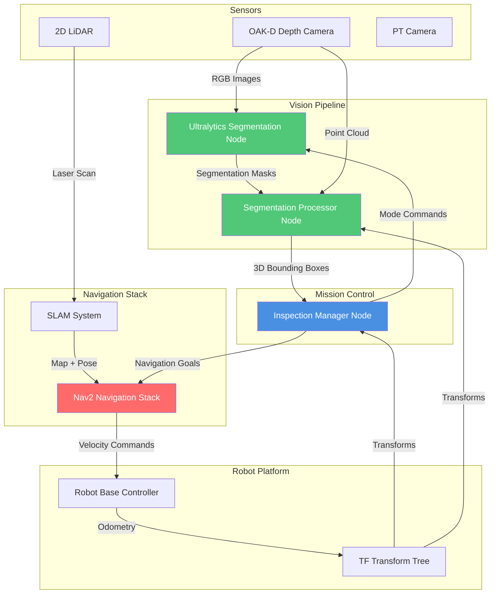

**Key Components:**
- **Vision Pipeline**: AI-powered object detection and 3D localization
- **Mission Control**: State machine orchestrating the inspection mission
- **Navigation Stack**: Autonomous path planning and execution
- **Robot Platform**: Physical robot with sensors and actuators

---

## 2. Package Architecture

### 2.1 System Component Diagram

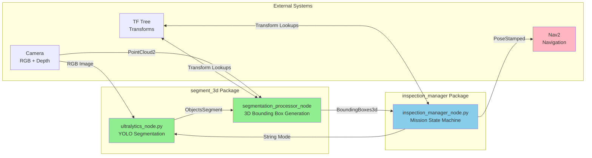

---

## 3. Segmentation 3D Package

### 3.1 Package Overview

The `segment_3d` package provides AI-powered 3D object detection by combining 2D semantic segmentation with depth information. It consists of two main nodes working in tandem.

### 3.2 Component Architecture

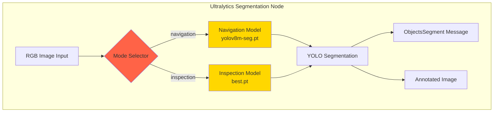

### 3.3 Segmentation Processor Flow

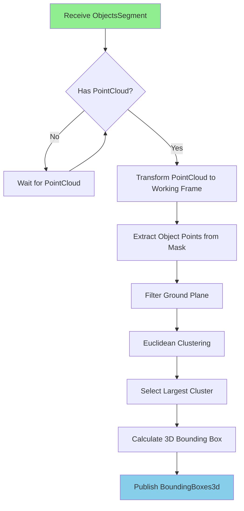

### 3.4 Data Flow: Segmentation Pipeline

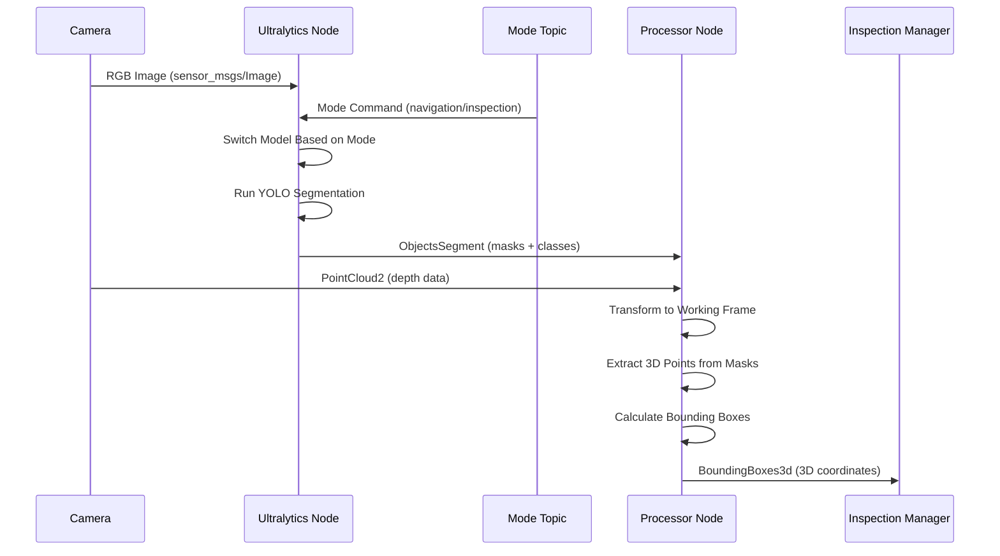

### 3.5 Node Responsibilities

#### Ultralytics Segmentation Node (`ultralytics_node.py`)

**Purpose:** Performs 2D semantic segmentation using YOLO models

**Key Functions:**
- Loads two YOLO segmentation models:
  - **Navigation Model** (`yolov8m-seg.pt`): Detects trucks for navigation
  - **Inspection Model** (`best.pt`): Detects wheels and truck parts for inspection
- Dynamically switches between models based on mission phase
- Converts RGB images to segmentation masks
- Publishes pixel-level object masks with class labels

**Inputs:**
- `/camera/image_raw` (RGB images)
- `/segmentation_mode` (mode command: "navigation" or "inspection")

**Outputs:**
- `/ultralytics/segmentation/objects_segment` (segmentation masks)
- `/ultralytics/segmentation/image` (annotated visualization)

#### Segmentation Processor Node (`segmentation_processor_node`)

**Purpose:** Converts 2D segmentation masks to 3D bounding boxes

**Key Functions:**
- Subscribes to segmentation masks and point clouds
- Transforms point clouds to working coordinate frame
- Extracts 3D points corresponding to segmentation masks
- Filters ground plane using RANSAC
- Performs Euclidean clustering to separate objects
- Calculates axis-aligned 3D bounding boxes
- Publishes 3D bounding boxes in world coordinates

**Inputs:**
- `/ultralytics/segmentation/objects_segment` (2D masks)
- `/camera/depth/points` or similar (PointCloud2)

**Outputs:**
- `/detections_3d` (BoundingBoxes3d with 3D coordinates)
- Debug markers and point clouds for visualization

---

## 4. Inspection Manager Package

### 4.1 Package Overview

The `inspection_manager` package implements a finite state machine (FSM) that orchestrates the complete truck inspection mission. It coordinates navigation, vision detection, and wheel-by-wheel inspection.

### 4.2 State Machine Diagram

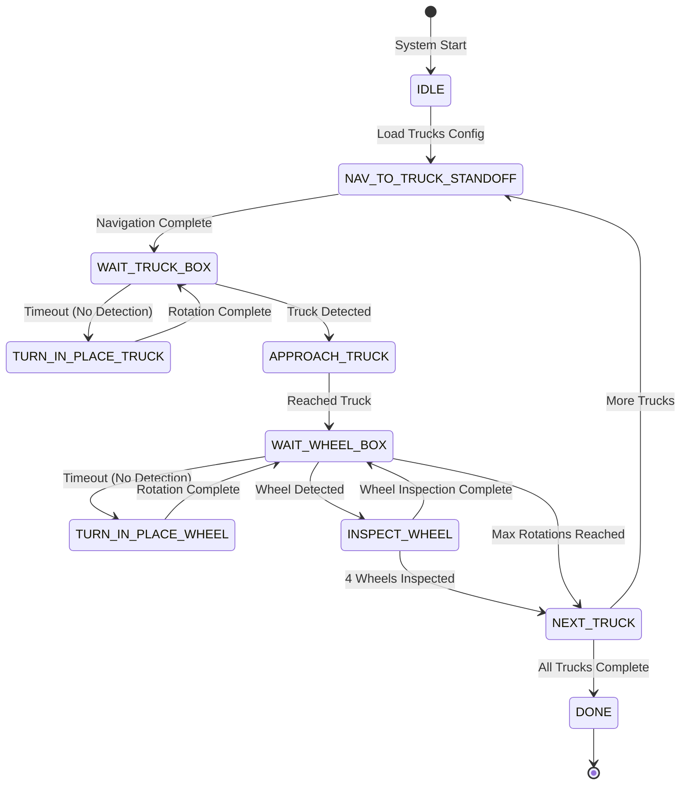

### 4.3 State Descriptions

| State | Purpose | Actions |
|-------|---------|---------|
| **IDLE** | Initial state | Loads truck configuration file |
| **NAV_TO_TRUCK_STANDOFF** | Navigate to truck area | Sends Nav2 goal to standoff position (2m from truck) |
| **WAIT_TRUCK_BOX** | Wait for truck detection | Publishes "navigation" mode, listens for truck bounding boxes |
| **TURN_IN_PLACE_TRUCK** | Recovery rotation | Rotates 45° if truck not detected, up to 8 attempts (360°) |
| **APPROACH_TRUCK** | Navigate to truck | Moves to 0.5m offset from detected truck |
| **WAIT_WHEEL_BOX** | Wait for wheel detection | Publishes "inspection" mode, listens for wheel bounding boxes |
| **TURN_IN_PLACE_WHEEL** | Recovery rotation | Rotates 45° if wheel not detected |
| **INSPECT_WHEEL** | Navigate to wheel | Moves to 0.4m offset from detected wheel |
| **NEXT_TRUCK** | Transition logic | Increments truck index, resets wheel tracking |
| **DONE** | Mission complete | All trucks inspected |

### 4.4 Mission Execution Sequence

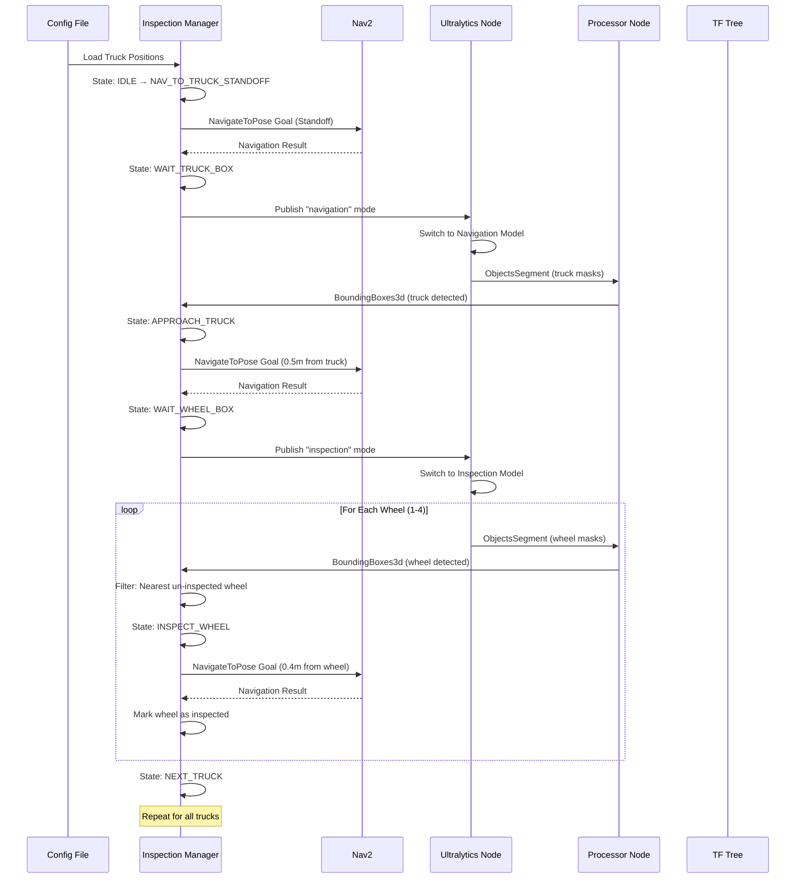

### 4.5 Wheel Detection Logic Flow

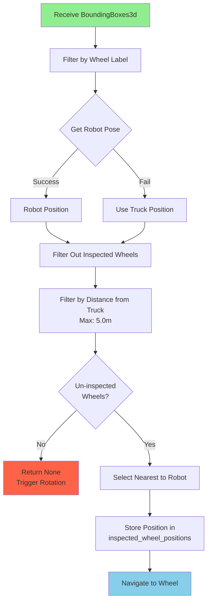

### 4.6 Data Structures and State Tracking

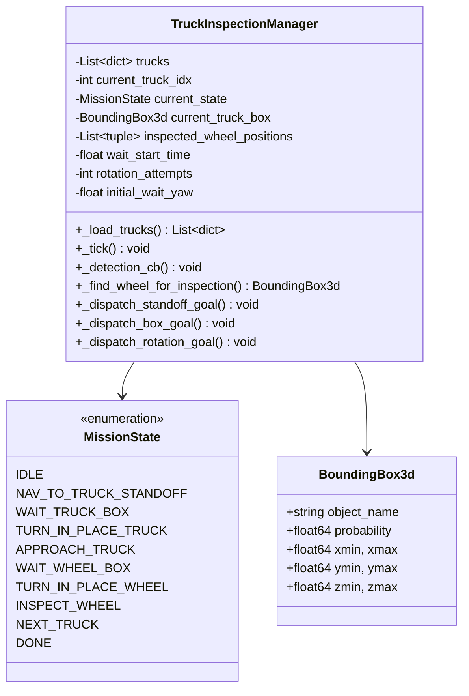

---

## 5. System Integration Flow

### 5.1 Complete Mission Flow

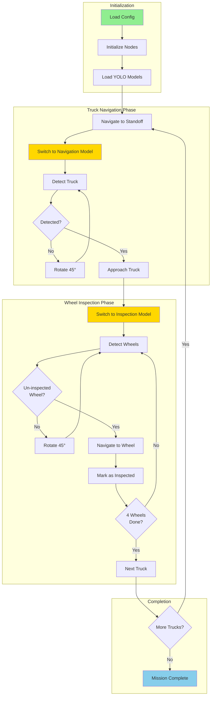

### 5.2 Model Switching Mechanism

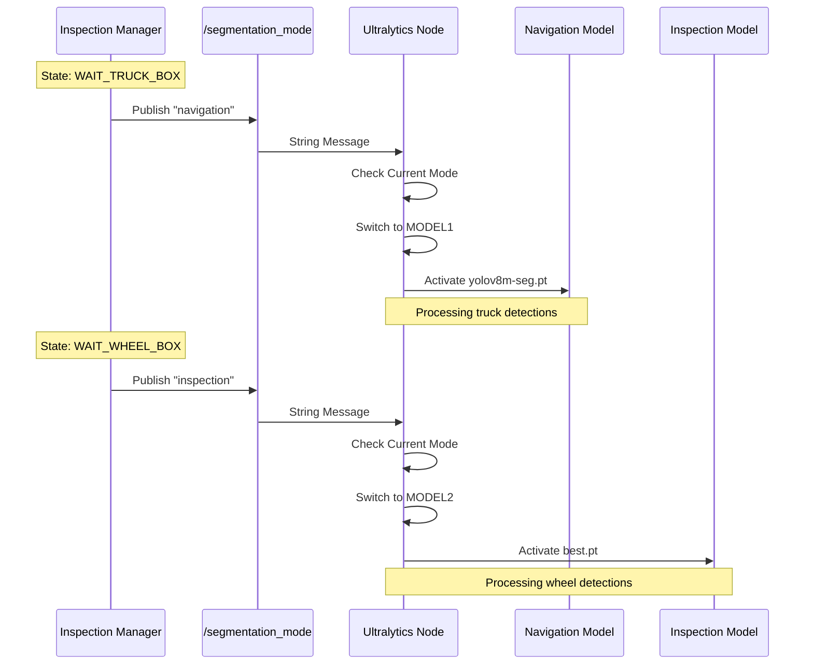

---

## 6. Key Algorithms

### 6.1 Wheel Selection Algorithm

The system uses a sophisticated algorithm to select the next wheel for inspection:

1. **Filter by Label**: Extract all wheels from detection message
2. **Get Robot Position**: Query TF tree for current robot pose
3. **Filter Inspected**: Remove wheels already visited (using position tolerance)
4. **Filter by Truck Proximity**: Remove wheels too far from current truck (>5m)
5. **Select Nearest**: Choose wheel closest to robot's current position
6. **Navigate**: Send navigation goal to selected wheel

**Pseudocode:**
```
function find_wheel_for_inspection(boxes):
    wheels = filter_by_label(boxes, "wheel")
    robot_pos = get_current_pose()
    truck_pos = get_truck_position()
    
    un_inspected = []
    for wheel in wheels:
        if not is_inspected(wheel) and is_near_truck(wheel, truck_pos):
            un_inspected.append(wheel)
    
    if un_inspected:
        return nearest_to_robot(un_inspected, robot_pos)
    return None
```

### 6.2 Recovery Rotation Strategy

When objects are not detected, the system implements a recovery strategy:

1. **Timeout Detection**: Wait for configurable timeout (default 5s)
2. **Rotation**: Rotate 45° increments
3. **Max Attempts**: Up to 8 rotations (360° total)
4. **State Transition**: After max attempts, move to next phase

This ensures the robot explores all viewing angles before giving up.

---

## 7. Message Flow Architecture

### 7.1 Topic Communication Diagram

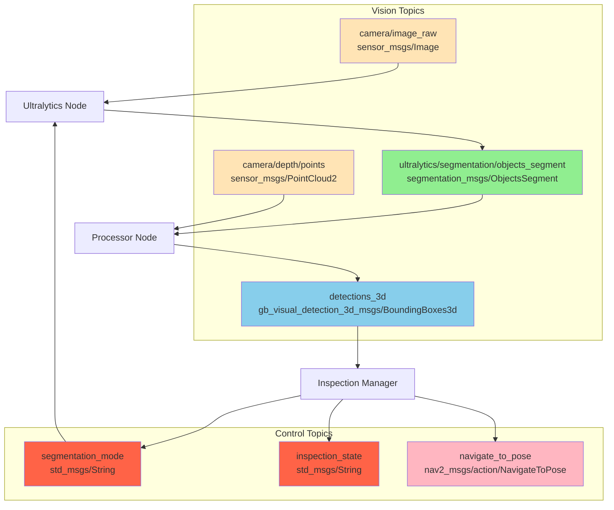

### 7.2 Action Server Communication

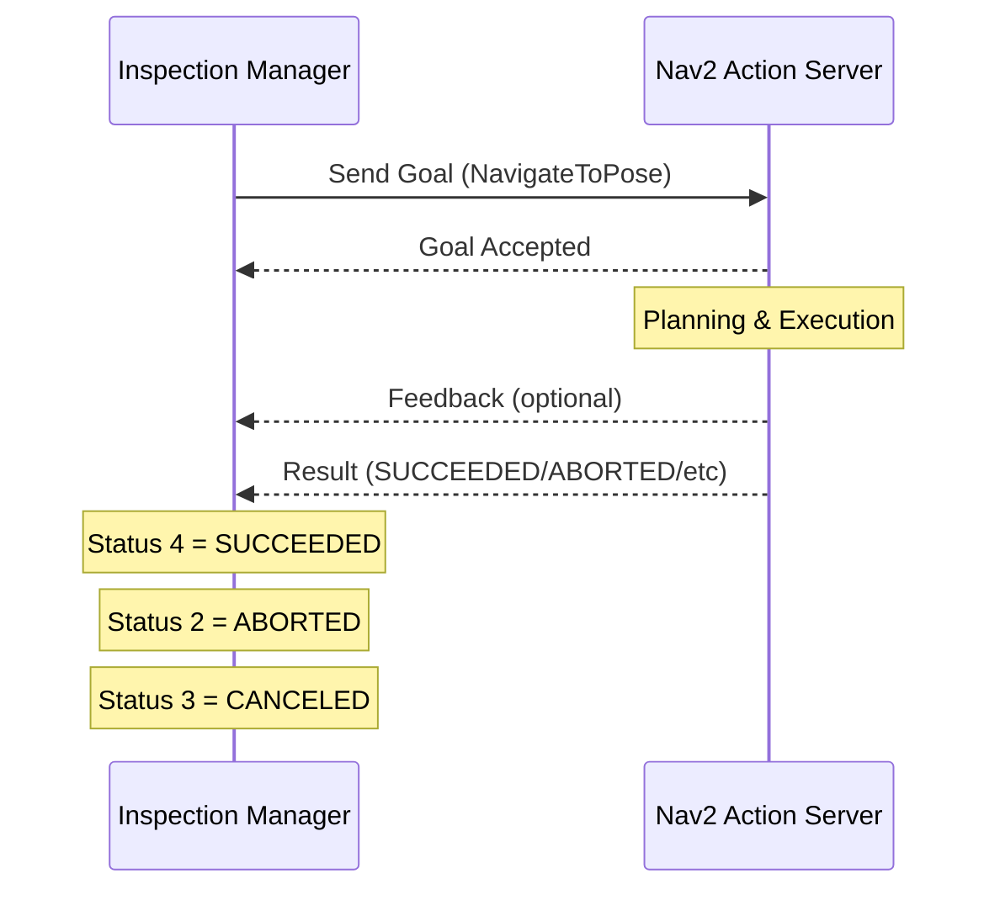

---

## 8. Configuration and Parameters

### 8.1 Inspection Manager Parameters

| Parameter | Default | Description |
|-----------|---------|-------------|
| `trucks_file` | `config/trucks.yaml` | Path to truck positions configuration |
| `standoff_distance` | 2.0 m | Distance from truck for initial approach |
| `approach_offset` | 0.5 m | Distance from truck for inspection |
| `wheel_offset` | 0.4 m | Distance from wheel for inspection |
| `truck_label` | "truck" | Object label for truck detection |
| `wheel_label` | "wheel" | Object label for wheel detection |
| `detection_timeout` | 5.0 s | Time to wait before recovery rotation |
| `rotation_angle` | 0.785 rad | Rotation increment (45°) |
| `max_rotation_attempts` | 8 | Maximum rotation attempts (360°) |
| `wheel_position_tolerance` | 0.5 m | Distance threshold for duplicate wheels |
| `max_wheel_distance_from_truck` | 5.0 m | Maximum distance wheel can be from truck |

### 8.2 Segmentation Parameters

| Parameter | Default | Description |
|-----------|---------|-------------|
| `navigation_model` | `yolov8m-seg.pt` | YOLO model for truck detection |
| `inspection_model` | `best.pt` | YOLO model for wheel detection |
| `mode_topic` | `/segmentation_mode` | Topic for mode switching |
| `default_mode` | `navigation` | Initial segmentation mode |

---

## 9. Error Handling and Recovery

### 9.1 Error Recovery Flow

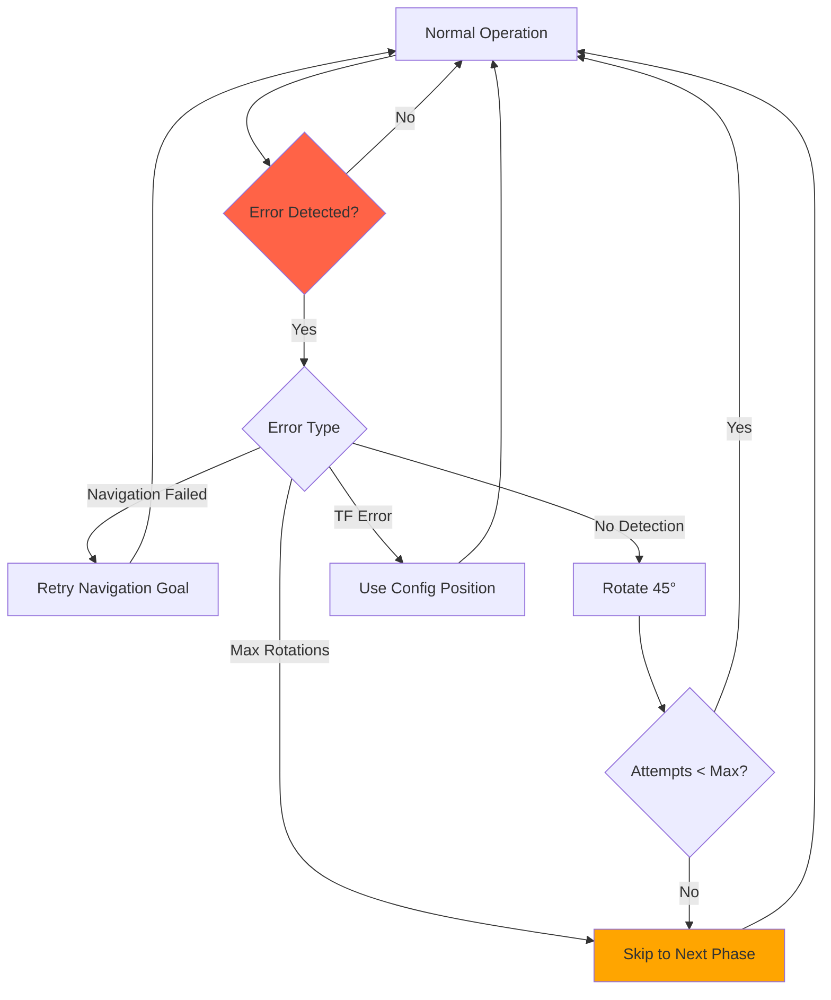

### 9.2 Resilience Features

1. **Timeout Handling**: Automatic recovery rotation if detections timeout
2. **Rotation Recovery**: Systematic 360° exploration before giving up
3. **Position Tracking**: Prevents duplicate wheel inspections
4. **Truck Filtering**: Ensures wheels belong to correct truck
5. **TF Fallback**: Uses configuration data if transforms unavailable

---

## 10. Performance Characteristics

### 10.1 System Timing

| Operation | Typical Duration | Notes |
|-----------|------------------|-------|
| Model Switching | < 100 ms | Instantaneous model activation |
| Segmentation | 50-200 ms | Depends on image resolution |
| 3D Processing | 100-500 ms | Point cloud processing time |
| Navigation Planning | 100-1000 ms | Depends on path complexity |
| Navigation Execution | Variable | Depends on distance and obstacles |
| Recovery Rotation | 2-5 s | 45° rotation execution |

### 10.2 Resource Utilization

- **CPU**: Moderate (segmentation is GPU-accelerated if available)
- **Memory**: ~0.5-1.2 GB (YOLO models loaded in memory)
- **Network**: Low bandwidth (only control messages)
- **Storage**: Model files (~100-500 MB per model)

---

## 11. Future Enhancements

### 11.1 Potential Improvements

1. **Multi-Truck Parallel Processing**: While navigating to the first truck and a detection of another truck is recived the vehicle could queue it for next inspection process without waiting to finish current truck and search for the second truck detection.
2. **Adaptive Standoff Distance**: Adjust based on truck size
3. **Wheel Ordering**: Intelligent sequence (front-left, front-right, etc.)
4. **License Plate OCR**: Extract and log license plate information
systems

---

## 12. Conclusion

This autonomous truck inspection system demonstrates a complete integration of:

- **AI Vision**: Dual-model YOLO segmentation for different mission phases
- **3D Perception**: Accurate 3D bounding box generation from 2D masks
- **Autonomous Navigation**: Robust path planning and execution
- **State Machine Control**: Reliable mission orchestration
- **Error Recovery**: Resilient operation in dynamic environments

The system is production-ready, configurable, and extensible for future enhancements. The modular architecture allows for easy integration with additional sensors, models, or mission types.

---

## Visual Results

### Autonomous navigation to truck position (Not accurate position) 


### 3D truck detection and segmentation  used for navigation

### 3D wheel detection  and navigation to the inspected wheel

### Another wheel detection and navigation to inspection


---
